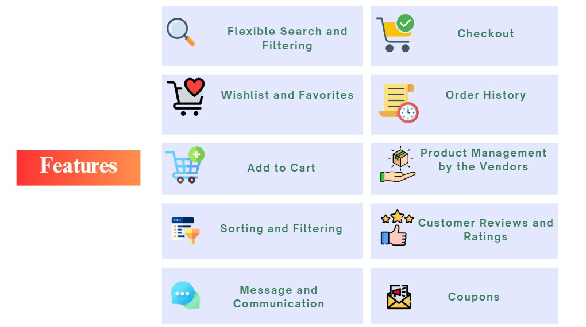
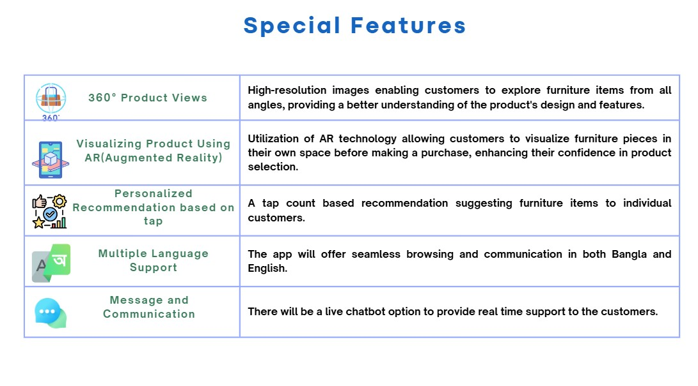
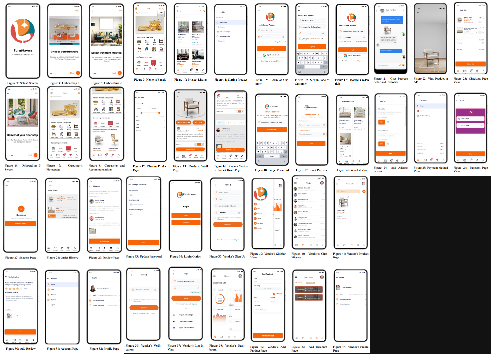

# FurniHaven: A Paradise for Furniture Lovers, Enhanced by AR Technology

  
## Project Description

FurniHaven is an innovative online furniture platform that connects consumers and sellers, offering a wide variety of furniture options. Using AR technology, users can visualize how items like sofas will look in their living spaces, while tap count tracks user preferences to provide personalized recommendations. To make quality furniture more accessible, the app will be available in Bangla, removing language barriers. Additionally, reviews and ratings will help users make informed choices. With advanced features and a user-focused design, FurniHaven aims to enhance the furniture shopping experience and transform the industry.

---

## Use Cases of Augmented Reality
## Watch Video

[)

---

## Key Features

    
    

---

## Prototyping and UI

[View the Prototype on Figma](https://www.figma.com/proto/f1HbF3ZdjlYymFspt2M9So/SDP-2?node-id=0-1&t=wzn36BP5AtwjMd6E-1)

    

